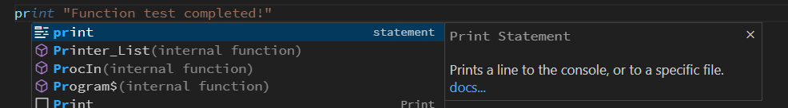
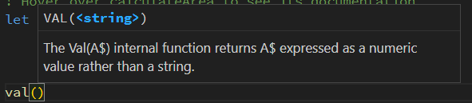
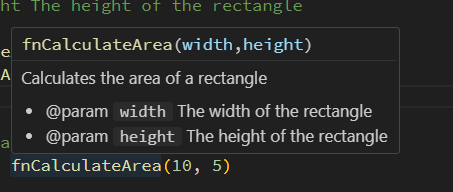

# Experience IntelliSense Features

The BR Language Extension provides rich IntelliSense support to make your coding more productive.

## Auto-Completion

Start typing and see intelligent suggestions:

```br
! Try typing these - notice the auto-completion
pr     ! Type 'pr' and see 'print' suggestion
le     ! Type 'le' and see 'let' suggestion
va     ! Type 'va' and see 'val' function suggestion
```

### What Completes Automatically:
- **Keywords**: `print`, `let`, `for`, `if`, `def`, etc.
- **Built-in Functions**: `val()`, `str$()`, `len()`, `mid$()`, etc.
- **Statements**: `input`, `goto`, `gosub`, `return`, etc.
- **Local Variables**: Variables you've defined in your code
- **Library Functions**: Functions from your project libraries

## Hover Information

Hover your mouse over any function to see documentation:

```br
! Hover over 'val' to see its documentation
let number = val("123")

! Hover over 'mid$' to see parameter info
let substr$ = mid$("Hello World", 7, 5)
```

## Function Signatures

When typing function parameters, see signature help:

```br
! Type the opening parenthesis and see parameter hints
val(        ! Shows: VAL(<string>)
str$(       ! Shows: STR$(<number>)
```


## Custom Function Documentation

You can add rich documentation to your own functions using Javadoc-style comments:

```br
/** 
 * Calculates the area of a rectangle
 * 
 * @param width The width of the rectangle
 * @param height The height of the rectangle
 */
def fnCalculateArea(width, height)
    return width * height
end def

! Hover over calculateArea to see its documentation
let roomArea = fnCalculateArea(10, 5)
```



## Try It Yourself

1. **Type `pr`** and select `print` from the completion list
2. **Hover over `val`** in any existing code
3. **Type `str$(`** and see the signature popup
4. **Create your own function with documentation** and explore the hover information

The extension understands BR syntax and provides context-aware suggestions!