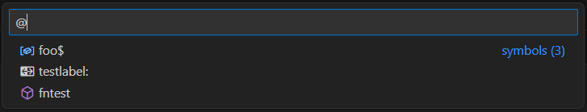
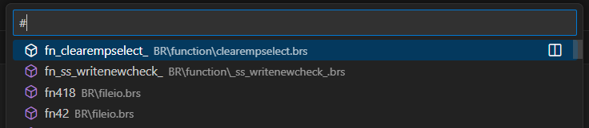

# Navigate Your Code Like a Pro

The BR Language Extension provides powerful navigation features to help you move through your code efficiently.

## Document Symbols & Outline

View the structure of your BR file:
1. **Open the Explorer panel** (Ctrl+Shift+E)
2. **Look for the "Outline" section** at the bottom
3. **See all your functions, variables, and labels** organized

```br
! This code will show up in the outline
def myFunction(param1, param2$)
    let localVar = 42
    print param1; param2$
fnend

def library libFunction(x, y$)
    print "Library function: "; x; y$
fnend

mainLoop:
    print "At main loop"
    goto mainLoop
```

## Go to Symbol

Quickly jump to any symbol in your workspace:

- **Press `Ctrl+Shift+O`** to see all symbols in current file

- **Press `Ctrl+T`** to search symbols across your entire workspace
- **Type the symbol name** to filter and jump
## Find All References

See where variables and functions are used:

1. **Right-click** on any variable or function name
2. **Select "Find All References"** (or press Shift+F12)
3. **See all usages** highlighted in the results panel

## Occurrence Highlighting

When you click on a variable or function:
- **All occurrences** in the current file are highlighted
- **Use Ctrl+Shift+Up/Down** to jump between occurrences

## Go to Definition

Jump to where variables and functions are defined:
- **Press F12** while cursor is on a symbol
- **Or Ctrl+Click** on any symbol
- **Works for both local and library functions**

Try these features with the sample code above! 